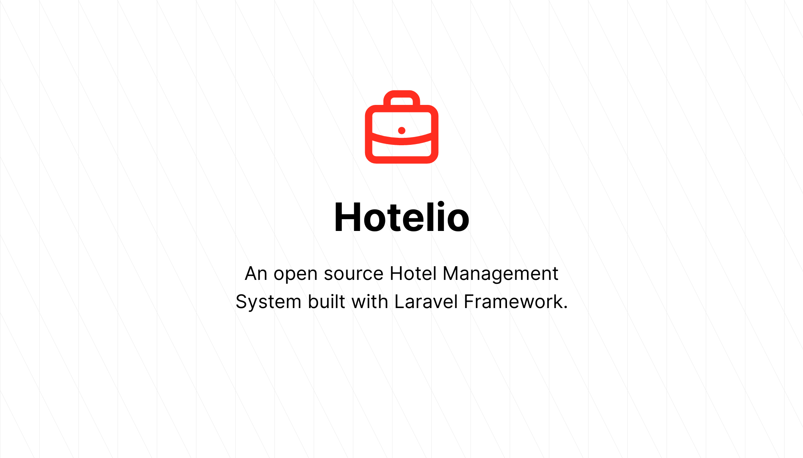

## Hotelio : Hotel Management System

Hotelio is a open source hotel management system that manages your hotel operations, smoothly, effortless. 

Hotelio is a open source hotel management system that manages your hotel operations smartly, smoothly, effortless.

## Contributing

You are warmly welcome to contribute to Hotelio. Thank you for considering contributing to the Hotelio!

## Security Vulnerabilities

If you discover a security vulnerability within Hotelio, please send an e-mail to mail4mjaman@gmail.com. All security vulnerabilities will be promptly addressed.

## License

The Hotelio is open-sourced software licensed under the [MIT license](https://opensource.org/licenses/MIT).
